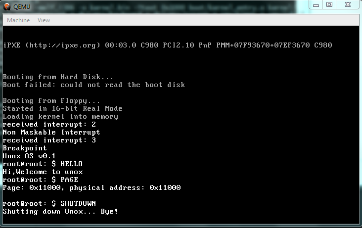

# Unox
Unox is a x86 unix-like operating system written in c and assembly for learn about operating systems.

## Roadmap
- [x] Write bootloader and linker
- [x] Write kernel in c
- [x] Port a tiny version of `libc` to our operating system
- [ ] Write a unix shell **[WIP]**
- [ ] Bash interpreter
- [ ] Excute unox on protected mode
- [ ] Write a file system(FAT32)
- [ ] Excute elf files

## Screenshots


## Build and Run
Requirements :
- i386 gcc cross compiler
- nasm
- qemo

at first clone this repo :
```
$ git clone https://github.com/bistcuite/unox-os
$ cd unox-os
```

make unox image :
```
$ make
```

run unox on qemu :
```
make run
```

## License
**[MIT](LICENSE)**
